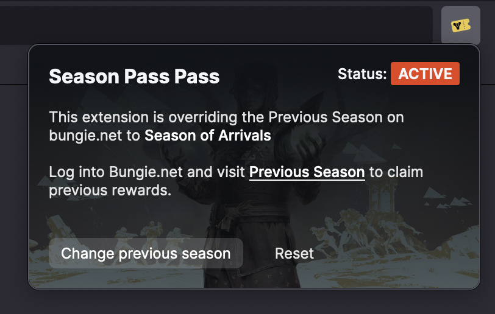

# Season Pass Pass

1. [Installing a release](#installing-a-release)
<!-- 2. [Using the extension](#using-the-extension) -->
2. [Building from source](#building-from-source)

Season Pass Pass is a browser extension for Firefox and Chrome that lets you view any previous Season Pass on Bungie.net and claim rewards from them.

> Note: This extension requires permission to view all requests/data for bungie.net. See [Permissions](#permissions) for more details.

## Installing a release

I didn't submit this extension to Firefox and Chrome review soon enough, so it is not yet available for install from the respective browser extension sites. Instead, you can install the extension manually using the browser's developer mode, which is fairly easy.

### Chrome

1. Download the latest release from [Releases](https://github.com/joshhunt/season-pass-extension/releases) and unzip to a safe spot.
2. Go to Chrome's Extension page: "Three dots menu" > Settings > Extensions (or, navigate to `chrome://extensions`)
3. Turn on Developer Mode via the toggle on the top right of the page
4. Click the "Load unpacked" button at the top right and select the unzipped extension folder from step 1.
5. You should see the  Season Pass Pass extension display in the list of installed extensions.
6. For easier access, you can pin the extension to your toolbar from the jigsaw extensions toolbar menu.

### Firefox

1. Download the latest release from [Releases](https://github.com/joshhunt/season-pass-extension/releases) and keep in a safe spot. There is no need to unzip it.
2. Go to the page `about://debugging` and click "This Firefox" in the right hand menu.
3. Click the "Load temporary Add-on..." button and select the zipped extension from step 1.
4. You should see the  Season Pass Pass extension display in the "Temporary Extensions" list.
5. The extension will automatically be removed when you restart Firefox. If you want to use it again you will need to reinstall it.

## Using the extension

1. Visit Bungie.net and log in with your Destiny/Bungie.net account.
2. Click the extension's toolbar icon (or from the jigsaw extension menu in Chrome), and click the "Change previous season" button to select the season to pull rewards from.
   - If the extension still reads "Visit Bungie.net to initialise Season Pass Pass", try refreshing the page and reopening the extension
   - If the extension does not display the above message, but the "Change previous button" is not visible, try leaving the menu open for a little while longer for it to download the required data.
3. Visit the [Previous Season](https://www.bungie.net/7/en/Seasons/PreviousSeason) page and claim rewards. Be sure to view the rewards available on each character.
   - If the Previous Season page displays a spinner forever, make sure you're logged in and hard refresh the page.

## Building from source

### Requirements

Season Pass Pass has been built with **Node 16.13.2** and **Yarn 1.22.15**. The extension has been tested with **Chrome 98.0.4758.102 (Official Build) (arm64)** and **Firefox 97.0**.

### Build

- Check out this repository
- `yarn install`
- `yarn build`
- The unpacked extension is build into ./dist directory
- Follow your browser's instructions for loading an unpacked extension in development mode

### Package

- `yarn install`
- `yarn build`
- `yarn package`
- Extension is packaged into ./artifacts directory as a zip archive

<!-- ## Permissions -->
